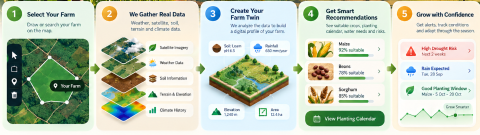

# TerraPlan

<p align="center">
  
</p>

**Understand your land before you plant.**

TerraPlan is a climate-smart agricultural decision-support system that combines weather, satellite observations, modeled soil properties, terrain, historical climate, and available JKUAT Conduit ground observations into a land-specific environmental profile. It turns that evidence into explainable crop suitability, water and climate-risk assessments, and a seasonal crop plan.

TerraPlan is designed to support decisions without presenting missing environmental evidence as a confirmed measurement.

## The Problem

Farmers make connected decisions about crop selection, planting periods, rainfall, water availability, soil conditions, and climate risks. The evidence needed for those decisions is often distributed across weather services, satellite catalogs, soil databases, terrain models, and ground-observation systems.

TerraPlan brings those sources into one traceable workflow and converts them into practical, land-specific decision support.

## What TerraPlan Does

```text
Select Land
    ↓
Collect Environmental Data
    ↓
Build Land Intelligence / Farm Digital Twin
    ↓
Crop + Water + Climate Risk Analysis
    ↓
Generate Agricultural Decisions
    ↓
Create Seasonal Crop Plan
```



## JKUAT Conduit Integration

TerraPlan currently consumes JKUAT Conduit observations from a bundled historical JSON fixture. The management ingestion command parses and normalizes the dataset, removes duplicates, calculates hourly aggregates, records quality information, and stores the results in PostgreSQL. This is a local historical dataset workflow; it is not a live Conduit API integration and must not be described as real-time.

For a selected farm, the Conduit provider searches the ingested station database and accepts an aggregate only when it satisfies the implemented proximity, elevation, recency, and quality rules. An accepted Conduit payload can contain:

- temperature mean, minimum, and maximum
- relative-humidity mean, minimum, and maximum
- wind-speed mean, minimum, and maximum
- vapour-pressure deficit (VPD)
- observation count and coverage
- source, timestamps, data mode, and quality metadata

Conduit is not treated only as a dashboard reading. Accepted Conduit-derived VPD enters the snapshot context and can change the drought-safety component of deterministic crop suitability. It can also contribute to the drought-risk assessment, while seasonal temperature and rainfall continue to come from the climate and weather providers. Temperature, humidity, and wind are retained in the Conduit snapshot payload, but the current decision context does not directly use all of them.

```text
JKUAT Conduit historical observations
                 ↓
Fixture ingestion + normalization + hourly aggregation
                 ↓
Distance + elevation + recency + quality eligibility
                 ↓
Environmental Snapshot
                 ↓
Farm Digital Twin / Land Intelligence Profile
                 ↓
Conduit VPD → crop drought safety + drought-risk evidence
                 ↓
Crop suitability and seasonal planning inputs
```

If the database has no eligible Conduit station or recent accepted aggregate, TerraPlan records Conduit as unavailable. In that state, Conduit does not affect the runtime recommendation.

## Environmental Data Sources

| Data | Source | Purpose | Availability note |
| --- | --- | --- | --- |
| Weather | Open-Meteo | Current conditions, precipitation, wind, and forecast | Network-dependent |
| Satellite | Sentinel-2 through Copernicus Data Space | NDVI, NDMI, and vegetation condition | Requires credentials and a suitable cloud-filtered scene |
| Soil | SoilGrids | Modeled soil pH, texture, and related properties | Network and coverage-dependent |
| Terrain | Copernicus DEM GLO-30 | Elevation and slope | Tile and coverage-dependent |
| Climate | Open-Meteo historical/archive data based on ERA5-family reanalysis | Seasonal temperature and rainfall baseline | Network and archive coverage-dependent |
| Ground observations | JKUAT Conduit historical fixture imported into PostgreSQL | Local temperature, humidity, wind, and VPD evidence | Requires an eligible ingested station aggregate; not live |

Provider failure is represented as unavailable evidence rather than replaced with a fabricated live measurement.

## Data Fusion / Farm Digital Twin

```text
Weather + Satellite + Soil + Terrain + Historical Climate + Conduit
                                ↓
                 Versioned Environmental Snapshot
                                ↓
          Farm Digital Twin / Land Intelligence Profile
                                ↓
                    Deterministic Decision Engines
```

A user-drawn polygon is validated and stored as a farm geometry revision. The worker retrieves environmental evidence for that area, preserves each provider's status and provenance, and writes a versioned analysis snapshot. Crop, risk, climate, and planner services read this shared snapshot rather than maintaining unrelated copies of farm conditions.

## Crop Suitability Engine

Crop suitability is deterministic and rule-based. Crop requirements are loaded from the versioned crop registry and compared with the environmental snapshot using these implemented weights:

| Component | Weight |
| --- | ---: |
| Temperature | 25% |
| Water / rainfall | 30% |
| Soil compatibility | 20% |
| Heat safety | 10% |
| Drought / flood safety | 10% |
| Environmental condition / NDVI | 5% |

The engine reports component scores, the limiting factor, input completeness, and a human-readable reason. A final score requires temperature and rainfall evidence. Other unavailable components are excluded and the remaining weights are normalized rather than silently treated as confirmed readings. Accepted Conduit VPD can reduce drought safety when evaporative demand is high. AI does not calculate or override the numerical score.

## Climate Intelligence & Water Analysis

TerraPlan implements deterministic assessments for:

- rainfall deficit relative to a seasonal baseline
- drought, with available VPD evidence
- heat stress
- seven-day heavy rainfall
- terrain-and-rainfall flood exposure
- wind exposure
- crop rainfall adequacy and irrigation contribution

The water calculation compares seasonal rainfall plus specified irrigation with each crop's configured rainfall range. It is an agricultural planning estimate, not a complete FAO ET₀ crop-water-requirement model or an engineering irrigation design.

## Seasonal Crop Plan

The planner builds and validates a farm-specific calendar using crop suitability, snapshot-derived seasonal context, crop duration, planting months, cultivation mode, rotation preferences and penalties, farm area, and overlapping allocation checks. Optimization and service rules prevent incompatible allocations and carry crop stages through planting, growth, and harvest. Because suitability is an input, accepted Conduit VPD can influence planning indirectly through the crop score.

## AI Explanations

```text
Environmental Data
        ↓
Deterministic Rule-Based Engines
        ↓
Calculated Results
        ↓
AI Explanation
```

When configured, TerraPlan sends calculated crop or plan context to OpenRouter using the configured model (the repository default is `google/gemini-flash-1.5-8b`) to generate explanatory text. AI does not generate the crop suitability or risk numbers. If the AI service or key is unavailable, the core engines continue to work and deterministic fallback explanations are used.

## Data Provenance & Reliability

Environmental envelopes and snapshots retain, where supplied:

- provider/source
- acquisition timestamp
- retrieval timestamp
- availability/evidence status
- live, historical-replay, or demonstration data mode
- quality information
- spatial resolution or geographic relevance

Unavailable providers remain explicitly unavailable. Demonstration values are identified by their data mode and are not presented as live measurements.

## Architecture

```text
Frontend
React + TypeScript + Vinext/Vite + MapLibre
        ↓
FastAPI Backend
        ↓
Environmental Provider Layer
        ↓
Weather + Satellite + Soil + Terrain + Climate + Conduit
        ↓
Versioned Environmental Snapshot
        ↓
Crop Suitability + Risk + Water + Planner Engines
        ↓
Optional AI Explanation
```

PostgreSQL/PostGIS stores users, farms, geometry revisions, observations, jobs, snapshots, and plans. Redis supports job signaling, while the worker claims committed analysis jobs and persists provider results.

## Tech Stack

**Frontend**

- React 19 and TypeScript
- Vinext/Vite with Next.js-compatible routing and components
- Tailwind CSS
- MapLibre GL JS and Turf
- Vitest

**Backend**

- FastAPI and Python 3.12
- Pydantic and SQLAlchemy
- PostgreSQL/PostGIS
- Redis
- OR-Tools

**Infrastructure and testing**

- Docker and Docker Compose
- Pytest, pytest-asyncio, and Hypothesis

## Hack The Weather 2026

TerraPlan turns environmental evidence into agricultural decision intelligence:

```text
DATA
Conduit + Weather + Satellite + Soil + Terrain + Climate

  ↓

INSIGHT
Land Intelligence Profile

  ↓

DECISION
Crop Suitability + Water + Climate Risk

  ↓

ACTION
Crop Selection + Seasonal Plan + Risk Preparation

  ↓

IMPACT
Better-informed, climate-aware agricultural decisions
```

JKUAT Conduit contributes ground-observation evidence when an ingested station aggregate passes the implemented eligibility and quality checks.

## Installation

The internal directory names, environment variables, API routes, and Docker service names retain their existing FarmTwin identifiers for backward compatibility.

```bash
git clone <repository-url>
cd farmtwin
cp backend/.env.example backend/.env
docker compose build
docker compose up -d
```

Open:

```text
Frontend:  http://localhost:3000
API:       http://localhost:8000
API Docs:  http://localhost:8000/docs
```

Stop the stack with:

```bash
docker compose down
```

## Accuracy and Limitations

- Environmental sources have different spatial and temporal resolutions.
- Satellite observations can be affected by clouds and acquisition timing.
- Weather forecasts change as new observations become available.
- SoilGrids provides modeled estimates and is not equivalent to laboratory soil testing.
- Conduit stations may not exist near every selected farm.
- Ground observations can have temporal gaps, quality limitations, and limited spatial representativeness.
- The current Conduit integration uses an imported historical fixture rather than a live API.
- The water model estimates rainfall adequacy; it is not a complete ET₀ irrigation model.
- TerraPlan provides decision support and does not replace local agronomic, soil, hydrological, or safety expertise.
